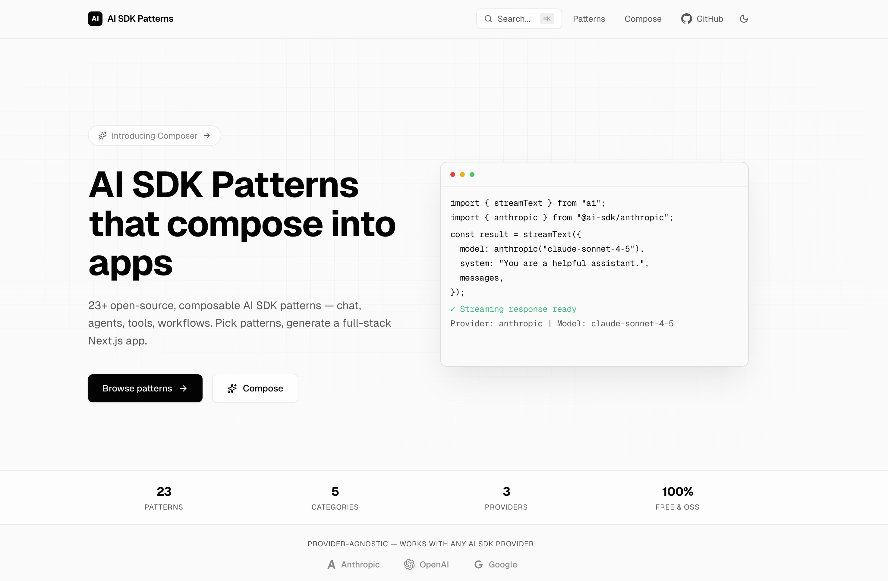

# AI SDK Patterns



> 23+ open-source, composable AI SDK patterns. Install one or combine many into a full-stack Next.js app.

**[ai-sdk-patterns.vercel.app](https://ai-sdk-patterns.vercel.app)**

## What is this?

A collection of production-ready AI SDK v6 patterns — chat, agents, tool calling, RAG, workflows — that you can:

1. **Browse** — Read the code, see static previews, understand the pattern
2. **Install** — `npx shadcn add https://ai-sdk-patterns.vercel.app/r/streaming-chat`
3. **Download** — Get a complete working Next.js app as a ZIP
4. **Compose** — Pick multiple patterns, generate one integrated app with shared routing and merged dependencies
5. **Prompt** — Copy a ready-made prompt for Claude, Cursor, or Windsurf to integrate the pattern into your project

## Patterns

### Core / SDK
| Pattern | Difficulty | Description |
|---|---|---|
| Streaming Chat | Beginner | `streamText` + `useChat` for real-time token streaming |
| Structured Output | Beginner | `generateObject` with Zod schemas |
| Text Generation | Beginner | Basic `generateText` with form input |
| Image Generation | Intermediate | `generateImage` with base64 rendering |
| Streaming Object | Intermediate | `streamObject` with partial JSON streaming |
| Generative UI | Intermediate | Render React components from AI tool calls |
| JSON Renderer | Intermediate | Render AI-generated JSON as visual components |
| Form Generator | Intermediate | AI generates dynamic forms from descriptions |
| CSV Editor | Intermediate | AI-assisted tabular data editing |

### Chat
| Pattern | Difficulty | Description |
|---|---|---|
| Markdown Chat | Beginner | Rich markdown rendering in chat |
| Reasoning Display | Intermediate | Show AI chain-of-thought/thinking |
| Chat with Citations | Intermediate | Inline citations with source cards |
| Code Artifact | Advanced | Chat-based code generation with syntax highlighting |

### Agents
| Pattern | Difficulty | Description |
|---|---|---|
| Tool Calling | Intermediate | `tools` param + multi-step tool loop |
| Multi-Step Agent | Advanced | `maxSteps` + automatic tool result forwarding |
| Routing Agent | Intermediate | Route to specialized sub-agents based on input |
| Orchestrator Agent | Advanced | Parent agent delegates to child agents |
| Evaluator Optimizer | Advanced | Generate, evaluate, iterate loop |

### Tools
| Pattern | Difficulty | Description |
|---|---|---|
| Web Search | Intermediate | Third-party search APIs + source citations |
| RAG Pipeline | Advanced | Embed + vector search + grounded generation |

### Workflows
| Pattern | Difficulty | Description |
|---|---|---|
| Human-in-the-Loop | Intermediate | Pause execution, get user approval |
| Sequential Workflow | Intermediate | Chain multiple AI calls in sequence |
| Parallel Workflow | Advanced | Run multiple AI calls concurrently, merge results |

## Install a Pattern

Each pattern is a shadcn-compatible registry item. Install into any existing Next.js project:

```bash
npx shadcn add https://ai-sdk-patterns.vercel.app/r/streaming-chat
```

This installs the pattern files + all required dependencies (`ai`, `@ai-sdk/react`, `zod`, etc.) automatically.

## Compose Multiple Patterns

Visit [ai-sdk-patterns.vercel.app/compose](https://ai-sdk-patterns.vercel.app/compose) to:

1. Select multiple patterns
2. Preview the generated project structure
3. Download a single integrated Next.js app

The composed app includes:
- Shared routing between patterns
- Merged `package.json` with deduplicated dependencies
- Provider-agnostic `lib/model.ts` helper
- Tailwind CSS v4 + PostCSS config
- `.env.local` template + README

## Provider Agnostic

Every pattern works with any AI SDK provider. Set your preferred provider in `.env.local`:

```bash
DEFAULT_MODEL=anthropic:claude-sonnet-4-5   # default
# DEFAULT_MODEL=openai:gpt-4o
# DEFAULT_MODEL=google:gemini-2.0-flash

ANTHROPIC_API_KEY=sk-ant-...
# OPENAI_API_KEY=sk-...
# GOOGLE_GENERATIVE_AI_API_KEY=...
```

## Run Locally

```bash
git clone https://github.com/akashp1712/ai-sdk-patterns.git
cd ai-sdk-patterns
pnpm install
pnpm dev
```

The site runs as a fully static app — no API keys needed to browse patterns. AI routes are disabled by default (set `ENABLE_AI_ROUTES=true` to enable).

### Scripts

```bash
pnpm dev          # Start dev server
pnpm build        # Production build
pnpm validate     # Type-check all 23 patterns as standalone apps
```

## Tech Stack

- **Framework**: Next.js 16 (App Router)
- **AI**: Vercel AI SDK v6
- **UI**: shadcn/ui (new-york) + Tailwind CSS v4
- **Fonts**: Geist Sans + Geist Mono
- **Code**: Shiki syntax highlighting
- **Registry**: shadcn-compatible JSON at `/r/[name]`

## Contributing

Want to add a pattern? Each pattern lives in `lib/patterns.ts` as a self-contained object with:

- `id`, `title`, `description`, `category`, `difficulty`, `tags`
- `files[]` — array of `{ path, lang, content }` with full source code
- `relatedPatterns[]` — links to related patterns

Run `pnpm validate` before submitting to ensure your pattern type-checks correctly.

## License

MIT

## Author

Built by [Akash Panchal](https://github.com/akashp1712)
